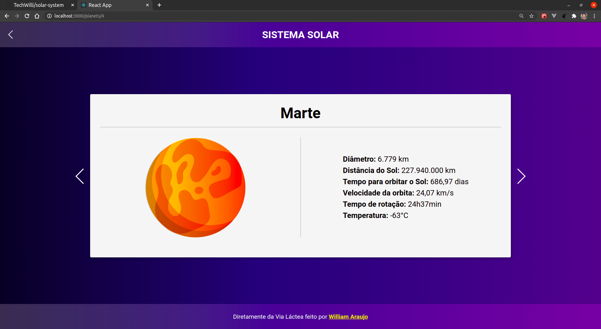

# SISTEMA SOLAR

### Projeto pessoal desenvolvido com ReactJS. O web app lista os planetas do nosso sistema solar, mostrando informações interessantes sobre cada um.

Os dados dos planetas estão disponível nesse [repositório](https://github.com/LeeonardoVargas/api-solar-system) do github no perfil do [Leonardo Vargas](https://github.com/LeeonardoVargas). Todos os créditos do desenvolvimento desta API são dele.

### Screenshots das telas desenvolvidas
Abaixo alguns screenshots do resultado final.

Rota para listagem de todos os planetas:

Rota /planets/:id para acessar os detalhes de cada planeta:

Rota para erro 404 not found:

